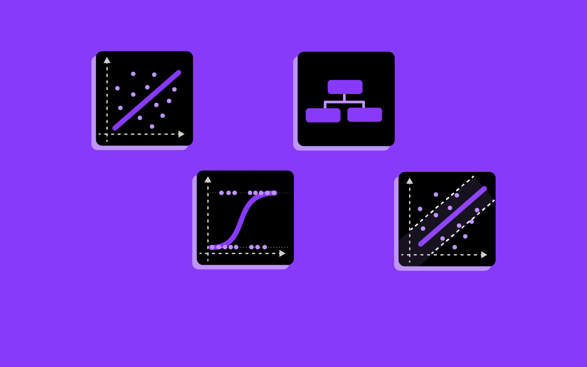

# Machine Learning Algorithms From Scratch

This repository contains implementations of traditional machine learning algorithms from scratch using Python. The purpose of this project is to provide and learn a deeper understanding of the internal workings of these algorithms by implementing them without relying on libraries like `scikit-learn` or `tensorflow`.

## Introduction
Machine learning is a field of artificial intelligence that uses statistical techniques to give computers the ability to learn from data. This repository provides implementations of key machine learning algorithms from scratch, including linear regression, logistic regression, and support vector machines (SVM).

The goal of this project is to:
- Implement popular machine learning algorithms without using external machine learning libraries.
- Gain a deep understanding of how these algorithms work under the hood.

## Algorithms That we are going to Implement

- **Linear Regression**: A simple regression model that assumes a linear relationship between input features and the target variable.
- **Logistic Regression**: A classification algorithm that models the probability of a binary outcome based on one or more features.
- **Support Vector Machine (SVM)**: A supervised learning algorithm used for both classification and regression tasks.
- **K-Nearest Neighbors (KNN)**: A simple classification algorithm that assigns a class based on the majority class of the K nearest neighbors.
- **Decision Tree**: A decision support tool that uses a tree-like model of decisions and their possible consequences.
- **Naive Bayes**: A classification technique based on Bayes' Theorem with an assumption of independence among predictors.
- **K-Means Clustering**: An unsupervised learning algorithm used to partition data into clusters.
- **Principal Component Analysis (PCA)**: A dimensionality reduction technique that transforms data into a set of uncorrelated variables called principal components.

More algorithms will be added over time.

